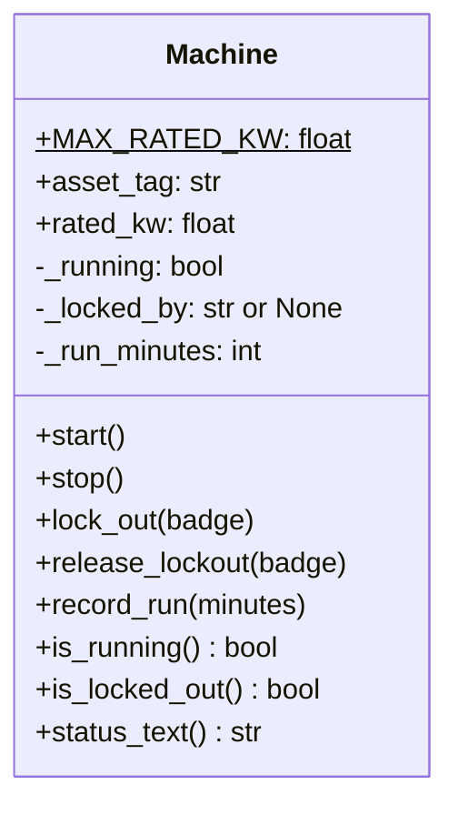
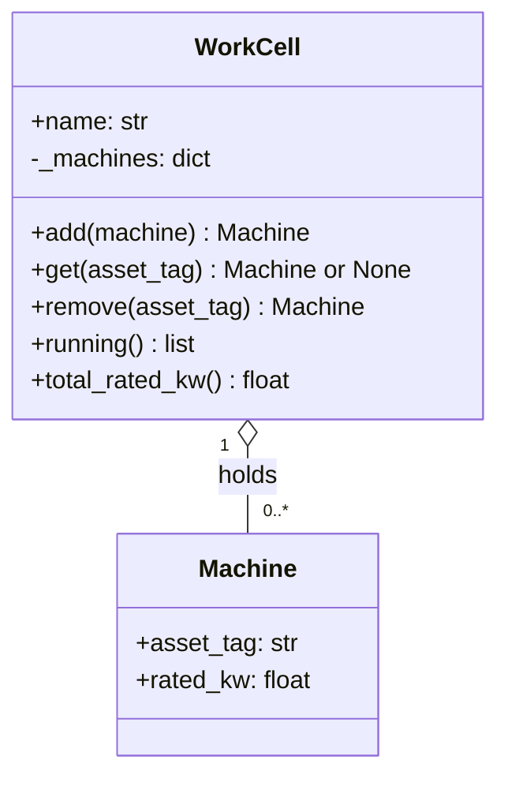

# Lecture Notes: Draw It Before You Build It
## 145065 Object-Oriented Programming · Unit 1 · Week 2, Tuesday

**Slides for this lesson:**
[outline](../04-slides/MCCTC_145065_Slides_W02_DrawItBeforeYouBuildIt.md). There is no exported deck
yet. To generate one, run this from the repository root:
`node tools/gamma.js Courses/145065/units/unit-01-classes-objects-encapsulation/04-slides/MCCTC_145065_Slides_W02_DrawItBeforeYouBuildIt.md --export pptx`

If you missed class, you can learn this concept from this file alone. You need paper, a pencil, and
Python.

**Competencies:** 5.1.3 model the solution using both graphic tools (e.g., flowcharts, IPO charts,
UML, decision trees, logic tables), pseudocode techniques and artificial intelligence. 5.6.7 document
a design using the appropriate tools (e.g., program flowchart, dataflow diagrams, Unified Modeling
Language [UML]).

The examples use Riverside Fabrication, Line 3. It is a composite: an invented small metal
fabrication shop.

---

## Why this exists

In 145060 you mostly opened an editor and started typing. For a 60-line program that is fine. For a
program with four classes, it is expensive. You find out on day three that two classes both think they
own the same data, and you rewrite both.

A class diagram is a design review you can do in five minutes. You draw the classes, what each one
holds, and what each one can do. A classmate reads it and asks "why does the cell know the press
temperature?" before a single line exists. Moving a box costs nothing. Moving code costs an afternoon.

The diagram is also a promise. Once your team agrees on it, the code must match it. Today you check
that promise with a program.

Your Week 3 refactor project requires the diagram to be committed **before** any class code. Your
commit history is the proof.

---

## The concept in plain language

A **UML class diagram** is a box per class with three compartments:

1. **Name.** The class name.
2. **Attributes.** The data each object holds, with a type after a colon.
3. **Methods.** What an object can do, with the return type after the parentheses.

Each attribute and method starts with a **visibility** mark:

| Mark | UML meaning | How this course writes it in Python |
|---|---|---|
| `+` | public: any code may use it | a normal name, like `start` or `asset_tag` |
| `-` | private: only the class may use it | one leading underscore, like `_running` |

Python has no enforced private, so `-` maps to the underscore convention from Monday. This course
writes the Python name exactly as it appears in the code, underscore included, so you can search for it.

A **static** or class-level member is shared by the whole class instead of belonging to one object.
UML underlines it. In text tools you mark it with `$` after the name. Week 3, Tuesday covers these.

Lines between boxes are **relationships**:

| Line | Name | Read it as |
|---|---|---|
| `-->` | association | "uses" or "knows about" |
| `o--` | aggregation (hollow diamond) | "holds", and the parts can exist without the whole |

A **multiplicity** on the line says how many. `1` means exactly one. `0..*` means zero or more.
`1..*` means at least one. Unit 2 adds composition, where the parts do not outlive the whole.

---

## Worked example 1: the Week 2 Machine, two ways

GitHub renders Mermaid diagrams written in Markdown fenced blocks, so the diagram can live in your
repository as text. The class diagram syntax is documented at
https://mermaid.js.org/syntax/classDiagram.html [VERIFY].



On paper, or in a plain text file, the same diagram looks like this:

```
+------------------------------------+
|              Machine               |
+------------------------------------+
| + MAX_RATED_KW: float  $           |
| + asset_tag: str                   |
| + rated_kw: float                  |
| - _running: bool                   |
| - _locked_by: str or None          |
| - _run_minutes: int                |
+------------------------------------+
| + start()                          |
| + stop()                           |
| + lock_out(badge)                  |
| + release_lockout(badge)           |
| + record_run(minutes)              |
| + is_running(): bool               |
| + is_locked_out(): bool            |
| + status_text(): str               |
+------------------------------------+
```

Read it from the top. The `$` line is one value shared by every machine. The `-` lines are internal
state. Every `+` method is a door into that state. Notice there is no `set_running` method. The
diagram already says the only way to run a press is `start()`, which can refuse.

---

## Worked example 2: a cell that holds machines



Plain text:

```
+---------------------------+            +-------------------+
|         WorkCell          |            |      Machine      |
+---------------------------+  1   0..*  +-------------------+
| + name: str               |<>----------| + asset_tag: str  |
| - _machines: dict         |   holds    | + rated_kw: float |
+---------------------------+            +-------------------+
| + add(machine): Machine   |
| + get(asset_tag): Machine |
| + remove(asset_tag)       |
| + running(): list         |
| + total_rated_kw(): float |
+---------------------------+
```

Read the line out loud: "one work cell holds zero or more machines." The hollow diamond `<>` sits on
the cell's side, the side that does the holding. A machine can exist before it joins a cell and after
it leaves one. That is why this is aggregation.

---

## Worked example 3: the code must keep the promise

The team agreed on the diagram above. Someone wrote the class from memory:

```python
# diagram_contract.py
# The class diagram is a promise. This checks the code keeps it.
class WorkCell:
    def __init__(self, name):
        self.name = name
        self._machines = {}

    def add_machine(self, machine):      # the diagram says add()
        self._machines[machine.asset_tag] = machine

    def get(self, asset_tag):
        return self._machines.get(asset_tag)


# Copied from the class diagram, Tuesday's whiteboard.
DIAGRAM_METHODS = ["add", "get", "remove", "running", "total_rated_kw"]

missing = [name for name in DIAGRAM_METHODS if not hasattr(WorkCell, name)]
print("Diagram methods missing from the code:", missing)
```

Output:

```
Diagram methods missing from the code: ['add', 'remove', 'running', 'total_rated_kw']
```

`hasattr(WorkCell, name)` asks the class whether it has something by that name. Four promises are
broken. Here is the version that keeps them, with two more checks that read the public and internal
names back out of the code:

```python
class WorkCell:
    def __init__(self, name):
        self.name = name
        self._machines = {}

    def add(self, machine):
        self._machines[machine.asset_tag] = machine
        return machine

    def get(self, asset_tag):
        return self._machines.get(asset_tag)

    def remove(self, asset_tag):
        return self._machines.pop(asset_tag)

    def running(self):
        return [m for m in self._machines.values() if m.is_running()]

    def total_rated_kw(self):
        return sum(m.rated_kw for m in self._machines.values())


DIAGRAM_METHODS = ["add", "get", "remove", "running", "total_rated_kw"]
missing = [name for name in DIAGRAM_METHODS if not hasattr(WorkCell, name)]
print("Diagram methods missing from the code:", missing)

public = [name for name in vars(WorkCell) if not name.startswith("_")]
print("Public methods in the code:", public)
print("Attributes on one object:", list(vars(WorkCell("Forming"))))
```

Output:

```
Diagram methods missing from the code: []
Public methods in the code: ['add', 'get', 'remove', 'running', 'total_rated_kw']
Attributes on one object: ['name', '_machines']
```

The public list matches the `+` methods. The attributes match the attribute compartment, `+name` and
`-_machines`. Code and diagram agree.

---

## The wrong version, and the error it produces

A teammate reads the diagram and writes code that uses the cell:

```python
forming = WorkCell("Forming")
forming.add(Machine("L3-PRS-01"))        # written from the diagram
```

Against the class that named its method `add_machine`:

```
Traceback (most recent call last):
  File "...\diagram_trust.py", line 16, in <module>
    forming.add(Machine("L3-PRS-01"))        # written from the diagram
    ^^^^^^^^^^^
AttributeError: 'WorkCell' object has no attribute 'add'
```

The teammate did nothing wrong. They trusted the design. The class broke the promise, and the error
shows up in someone else's file. On a team of four, that costs a conversation and a rename across
every file that already used the wrong name.

---

## Why the wrong version is tempting

`add_machine` is a perfectly good name. It might even be a better one. The mistake is not the name.
The mistake is changing the design in the code without changing the diagram and telling the team.

It is also tempting to skip the diagram entirely, because it feels like work that is not code. It is
the cheapest work in the project. If the design is wrong, you find out while it is still pencil.

The habit: when the code needs to differ from the diagram, update the diagram in the same commit.

### Using AI to draft a diagram

Competency 5.1.3 names artificial intelligence as a modeling tool. A local model can turn a
description like "a work cell holds machines and totals their power" into Mermaid text in seconds.
Treat that draft as a first guess. Check every box against the requirements: a missing refusal, an
invented method, or a public attribute that should be internal is common. And keep every description
you give an AI tool free of personal data: no names, no badge numbers of real people, nothing about
you or a classmate.

---

## Vocabulary

| Term | What it means |
|---|---|
| **UML** | Unified Modeling Language, a standard set of diagrams for software design |
| **Class diagram** | a UML diagram of classes, their attributes, methods, and relationships |
| **Compartment** | one of the three sections of a class box: name, attributes, methods |
| **Visibility** | who may use a member: `+` public, `-` private (internal in Python) |
| **Static member** | shared by the whole class, marked `$` or underlined |
| **Association** | a "uses" or "knows about" relationship |
| **Aggregation** | a "holds" relationship where the parts can exist on their own |
| **Multiplicity** | how many objects take part, like `1` or `0..*` |
| **Mermaid** | a text format for diagrams that GitHub renders in Markdown |

---

## Self-check

**Question 1.** Write the plain text line for an internal attribute `_temperature_c` that holds a
float, and the line for a public method `record_temperature` that takes `celsius` and returns
nothing.

**Question 2.** A diagram shows `Team "1" o-- "1..*" Player`. Say it in one sentence. Could a team
have zero players?

**Question 3.** A contract check prints `Diagram methods missing from the code: ['remove']`, but you
are sure the class can remove machines. What is the most likely cause, and what are the two ways to
fix it?

---

### Answers

**1.** `- _temperature_c: float` and `+ record_temperature(celsius)`. The minus marks it internal,
and the underscore is how Python writes that.

**2.** "One team holds one or more players." No. The lower bound is 1, so the design says a team
always has at least one player. `0..*` would allow an empty team.

**3.** The method exists under a different name, like `remove_machine`. Either rename the method to
match the diagram, or, if the team agrees the new name is better, update the diagram and the list in
the check. Either way, diagram and code must match in the same commit.
