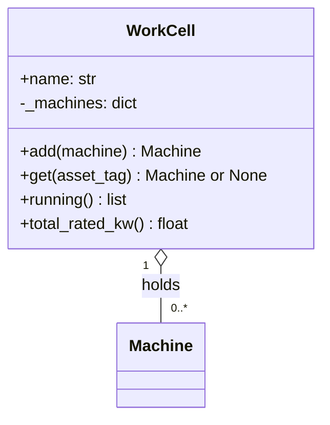

# Draw It Before You Build It
---
## Slide 1: Day three, two classes, one mess
- You start typing on day one
- Day three: two classes both own the same data
- You rewrite both
- A five-minute drawing would have caught it
Speaker notes: Think about the last group project where you all started coding right away. By day three, two people had written classes that both thought they owned the same data, and somebody had to rewrite their work. Today you learn the five-minute design review that catches that before any code exists. Moving a box on paper costs nothing. Moving code costs an afternoon.
Image: Two overlapping class boxes both labelled with the same data field, a pencil eraser hovering over one.
---
## Slide 2: A class diagram has three compartments
- Top: the class name
- Middle: attributes, with a type after a colon
- Bottom: methods, with the return type after
- Plus means public. Minus means internal.
Speaker notes: A UML class diagram is one box per class, split into three. Name on top. Attributes in the middle, what each object holds. Methods at the bottom, what each object can do. Every line starts with a visibility mark. Plus is public. Minus is private, and since Python has no enforced private, minus is the underscore convention from yesterday.
Image: One empty class box with its three compartments labelled Name, Attributes, Methods in launch blue.
---
## Slide 3: The Week 2 Machine on paper
```
+------------------------------------+
|              Machine               |
+------------------------------------+
| + MAX_RATED_KW: float  $           |
| + asset_tag: str                   |
| - _running: bool                   |
| - _locked_by: str or None          |
+------------------------------------+
| + start()                          |
| + lock_out(badge)                  |
| + release_lockout(badge)           |
| + is_running(): bool               |
| + status_text(): str               |
+------------------------------------+
```
Speaker notes: Here is yesterday's Machine as a diagram. The dollar sign marks a static member, one value shared by the whole class. On a whiteboard you can underline it instead. The minus lines are internal state. Every plus method is a door into that state. Now notice what is missing. There is no set running method. The diagram already says the only way to run a press is start, and start can refuse.
Image: None. This slide is code.
---
## Slide 4: The same diagram as text GitHub can draw

Speaker notes: GitHub renders Mermaid diagrams written in Markdown, so your diagram can live in your repository as text and change in the same commit as your code. This one adds a relationship. Read the last line out loud. One work cell holds zero or more machines.
Image: None. This slide is code.
---
## Slide 5: Lines between boxes
- Arrow: association, one class uses another
- Hollow diamond: aggregation, the whole holds parts
- The diamond sits on the side that holds
- 1 means exactly one. 0..* means zero or more
- Parts in an aggregation can exist alone
Speaker notes: An arrow means uses or knows about. A hollow diamond means holds, and the diamond sits on the side doing the holding. A press exists before it joins a cell and after it leaves one, so this is aggregation. The numbers are multiplicity. One is exactly one. Zero dot dot star is zero or more. One dot dot star is at least one. Unit 2 adds composition, where the parts do not outlive the whole.
Image: A WorkCell box and a Machine box joined by a line with a hollow diamond at the WorkCell end, labels 1 and 0..*.
---
## Slide 6: The diagram is a promise
```python
DIAGRAM_METHODS = ["add", "get", "remove", "running", "total_rated_kw"]

missing = [name for name in DIAGRAM_METHODS if not hasattr(WorkCell, name)]
print("Diagram methods missing from the code:", missing)
```
```
Diagram methods missing from the code: ['add', 'remove', 'running', 'total_rated_kw']
```
Speaker notes: The team agreed on the diagram. Somebody wrote the class from memory. These three lines copy the method names off the whiteboard and ask the class whether it has each one. Four promises broken. The class has add machine where the diagram says add, and three methods were never written.
Image: None. This slide is code.
---
## Slide 7: Watch a teammate trust the design
```
Traceback (most recent call last):
  File "...\diagram_trust.py", line 16, in <module>
    forming.add(Machine("L3-PRS-01"))        # written from the diagram
    ^^^^^^^^^^^
AttributeError: 'WorkCell' object has no attribute 'add'
```
Speaker notes: Here is the cost. A teammate read the diagram and called add. The error lands in their file, not in the file that broke the promise. They did nothing wrong. Add machine might even be a better name. The mistake was changing the design in code without changing the diagram. When code has to differ, update the diagram in the same commit.
Image: None. This slide is code.
---
## Slide 8: AI can draft it. You check it.
- A local model can turn a description into Mermaid
- Treat the draft as a first guess
- Check every box against the requirements
- Look for invented methods and missing refusals
- No personal data in any prompt, ever
Speaker notes: The state standard for modeling names artificial intelligence as a tool, and it is a good one for a first draft. Describe the system to a local model and it will give you Mermaid text in seconds. Then do your job. Check every box against the requirements. AI drafts often invent a method nobody asked for or make internal data public. And nothing personal goes into the prompt. No names, no real badge numbers, nothing about you or a classmate.
Image: A draft diagram with two boxes circled in launch red and a checklist beside it.
---
## Slide 9: What you are about to build
- Build 1: Lab U01-02 ToolCrib, Part 1
- Diagram the tool crib before any code
- Build 2: Refactor M1, choose your artifact
- Record the golden baseline, inventory data and functions
Speaker notes: Build 1 is Lab U01-02, Tool Crib, Part 1. Line 3's tool crib checks tools out to a badge, and a tool is overdue after 240 minutes. You diagram it on paper and in Mermaid before you write a class. Build 2 starts the refactor project, milestone 1. Pick your 145060 Data Pipeline, run it and save its output as the golden baseline, then list every piece of data and every function it has. Your diagram gets committed before any class code, and your commit history proves it.
Image: A paper class diagram next to a laptop showing the same diagram rendered, navy and launch blue.
