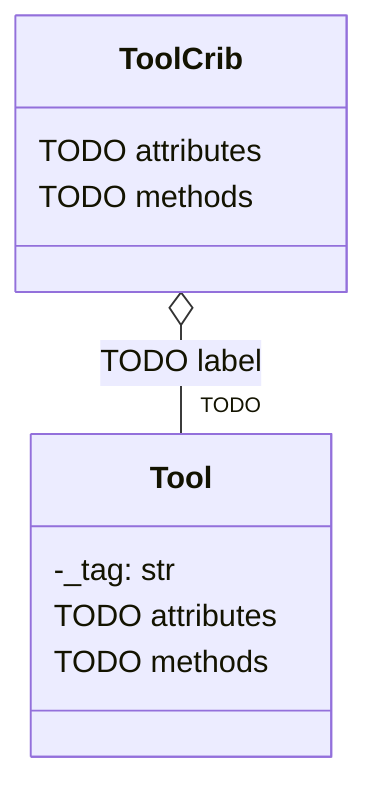

# Tool Crib Class Diagram

Lab U01-02, Part 1. Copy this file into your lab folder as `crib_diagram.md` and fill it in
**before you write any class code.** Riverside Fabrication is a composite shop.

## The diagram

Fill in both classes. Mark every member `+` (public) or `-` (internal, an underscore name in
Python). Give every attribute a type after a colon. Give every method its parameters and what it
returns. Fill in the multiplicity on the line between the classes.

If Mermaid does not render where you are viewing this, draw the same three-compartment boxes on
paper and photograph them. The text version above is the one you commit.

## Where each procedural function goes

One row for each of the eight functions in `tool_crib_procedural.py`.

| Procedural function | Becomes | Why (one sentence: what data does it need?) |
|---|---|---|
| `add_tool` | | |
| `check_out` | | |
| `check_in` | | |
| `is_out` | | |
| `tools_out` | | |
| `minutes_between` | | |
| `format_duration` | | |
| `crib_report` | | |

## The collection the crib keeps

Which Python collection holds the tools inside `ToolCrib`, and why? Name the question the crib
answers most often.

## Two things the diagram does not show

The rules. Write the two rules from the spec that the class must enforce and that no box or
line in the diagram can express.

1.
2.
