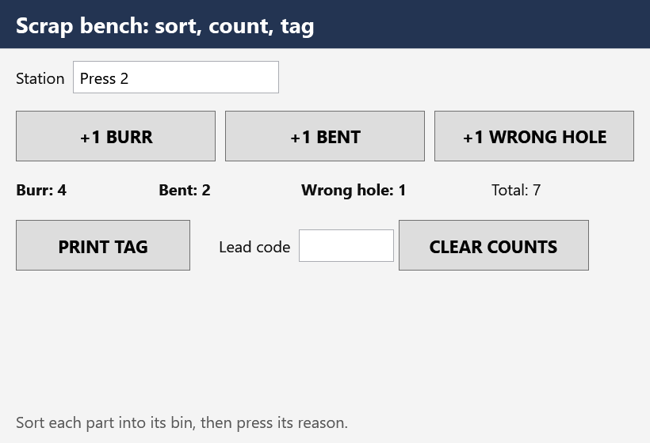

# Gate 2: Adversarial Review · Week 13
## 145065 Object-Oriented Programming · Unit 7 · Week 13, Friday

**Gate 2 is the gate where AI is the opponent.** You did not write this app. You are reviewing it,
and you are scored on what you catch against what you miss.

**35 minutes.** Individual and silent. You may and should build and run the app. You may not ask a
model whether it is correct, because a model is what is being reviewed.

**Everything here is invented.** Riverside Fabrication is a composite shop. The scrap bench, the lead
code, and the printer are made up, and the printer is simulated.

The app is in `gate2-w13-files/ScrapTag/`. Copy the folder, then:

```
dotnet build ScrapTag
dotnet run --project ScrapTag
```

---

## What you are looking at

A student gave an AI assistant the request in Part A and got back ScrapTag. It builds with no
warnings. The window looks right. The buttons count. **It passes a quick look.** That is the problem.

**There are exactly five planted defects, one for each Five-Dimension Code Review category:**
Correctness, Security, Readability, Performance, and Requirements Fit. They are **design** defects:
none of them stops the build.

**One of the five is arguable.** A reasonable reviewer could defend it. For that one, give the
strongest case that it is a defect and the strongest case that it is fine, then say where you land.

**One of the five hides.** You will not see it by pressing each button once.

---

## PART A: The request

> Write a WPF app, ScrapTag, for the scrap bench on Line 3. The operator sorts rejected parts by reason
> and prints a tag for each bin at the end of the shift.
>
> 1. A **Station** box. A tag cannot print without a station name, at most 20 characters.
> 2. Three reason buttons, **+1 BURR**, **+1 BENT**, and **+1 WRONG HOLE**. Each press counts one part
>    for that reason.
> 3. Show each reason's count and the total.
> 4. **PRINT TAG** sends the tag text to the bench label printer. A tag takes about two seconds to
>    print. **The window must keep responding while it prints.**
> 5. **CLEAR COUNTS** empties the counts for the next shift, but only for the shift lead, who types the
>    lead code into a password box. **The shop sets the lead code in the station's settings file,
>    `station.json`, and changes it every month. Do not put it in the program.**
> 6. Every button at least 64 pixels tall, for gloved hands.

---

## PART B: What the AI produced

The window, with a station name typed and a few parts counted:



`station.json`, the settings file the shop edits:

```json
{
  "bench": "Line 3 scrap bench",
  "printer": "bench-label-1",
  "lead_code": "4417"
}
```

`MainWindow.xaml`, rows 1 to 4 (the file has a heading above and a status line below):

```xml
<StackPanel Grid.Row="1" Orientation="Horizontal" Margin="20,16,20,0">
    <TextBlock Text="Station" VerticalAlignment="Center" Margin="0,0,10,0" />
    <TextBox x:Name="StationBox" Width="260" FontSize="20" Padding="6" MaxLength="20" />
</StackPanel>

<UniformGrid Grid.Row="2" Rows="1" Margin="14,16,14,0">
    <Button x:Name="BurrButton" Content="+1 BURR" Click="Button_Click" />
    <Button x:Name="BentButton" Content="+1 BENT" Click="Button_Click_1" />
    <Button x:Name="WrongHoleButton" Content="+1 WRONG HOLE" Click="Button_Click_2" />
</UniformGrid>

<StackPanel Grid.Row="3" Orientation="Horizontal" Margin="20,16,20,0">
    <TextBlock x:Name="BurrText" Width="180" FontWeight="Bold" />
    <TextBlock x:Name="BentText" Width="180" FontWeight="Bold" />
    <TextBlock x:Name="WrongHoleText" Width="240" FontWeight="Bold" />
    <TextBlock x:Name="TotalText" />
</StackPanel>

<StackPanel Grid.Row="4" Orientation="Horizontal" Margin="14,20,14,0">
    <Button x:Name="PrintButton" Content="PRINT TAG" Width="220" Click="PrintButton_Click" />
    <TextBlock Text="Lead code" VerticalAlignment="Center" Margin="30,0,10,0" />
    <PasswordBox x:Name="LeadCodeBox" Width="120" FontSize="20" Padding="6" VerticalAlignment="Center" />
    <Button x:Name="ClearButton" Content="CLEAR COUNTS" Width="240" Click="ClearButton_Click" />
</StackPanel>
```

A style in the window's resources sets every button's `MinHeight` to 64.

`MainWindow.xaml.cs`, complete. Line numbers count from the first line of the file.

```csharp
// MainWindow.xaml.cs
// ScrapTag: counts rejected parts at the Line 3 scrap bench by reason and
// prints a tag for the bin at the end of the shift.

using System.Windows;

namespace ScrapTag;

public partial class MainWindow : Window
{
    // Shift lead code required to clear the counts.
    private const string LeadCode = "4417";

    private readonly LabelPrinter printer = new();
    private int burr;
    private int bent;
    private int wrongHole;

    public MainWindow()
    {
        InitializeComponent();
        UpdateDisplay();
    }

    public LabelPrinter Printer => printer;

    // +1 BURR
    private void Button_Click(object sender, RoutedEventArgs e)
    {
        burr++;
        UpdateDisplay();
    }

    // +1 WRONG HOLE
    private void Button_Click_1(object sender, RoutedEventArgs e)
    {
        bent++;
        UpdateDisplay();
    }

    // +1 BENT
    private void Button_Click_2(object sender, RoutedEventArgs e)
    {
        wrongHole++;
        UpdateDisplay();
    }

    // Validates the station, prints the tag, and confirms to the operator.
    private void PrintButton_Click(object sender, RoutedEventArgs e)
    {
        if (string.IsNullOrEmpty(StationBox.Text))
        {
            StatusText.Text = "Enter a station name before printing.";
            return;
        }

        StatusText.Text = "Printing tag...";
        printer.Print(BuildTag());
        StatusText.Text = "Tag printed.";
    }

    // Clears the shift's counts once the shift lead's code is confirmed.
    private void ClearButton_Click(object sender, RoutedEventArgs e)
    {
        if (LeadCodeBox.Password != LeadCode)
        {
            StatusText.Text = "Lead code not accepted.";
            LeadCodeBox.Clear();
            return;
        }

        burr = 0;
        bent = 0;
        wrongHole = 0;
        LeadCodeBox.Clear();
        ArmReasonButtons();
        UpdateDisplay();
        StatusText.Text = "Counts cleared for the next shift.";
    }

    // Makes sure each reason button is connected to its handler for the new shift.
    private void ArmReasonButtons()
    {
        BurrButton.Click += Button_Click;
        BentButton.Click += Button_Click_1;
        WrongHoleButton.Click += Button_Click_2;
    }

    private string BuildTag() =>
        $"SCRAP | {StationBox.Text} | burr {burr} | bent {bent} | wrong hole {wrongHole} | total {burr + bent + wrongHole}";

    private void UpdateDisplay()
    {
        BurrText.Text = $"Burr: {burr}";
        BentText.Text = $"Bent: {bent}";
        WrongHoleText.Text = $"Wrong hole: {wrongHole}";
        TotalText.Text = $"Total: {burr + bent + wrongHole}";
    }
}
```

`LabelPrinter.cs` offers `Print(text)`, which returns when the printer is finished, and
`PrintAsync(text)`, which returns a `Task` without holding up the caller. Both take about two seconds.

**Read the request's items 4 and 5 against the code before you read anything else.**

---

## What to submit

For each defect: **where** (file and line), **which dimension**, **what goes wrong for the operator or
the shop if nobody catches it**, and **the fix**.

Then two more entries:

- **The arguable one.** Say which of your five it is. Give the strongest case that it is a defect and
  the strongest case that it is fine, then say where you land and why.
- **What I was unsure about.** Name something specific. A blank costs more than a wrong guess.

### How to spend 35 minutes

- **First 5:** build and run. Type a station, press every button, print a tag, and try the lead code
  from `station.json`.
- **Next 10:** read Part A one item at a time and point at the lines that meet it. Items 4 and 5
  first.
- **Next 10:** read every comment against the code under it, and every XAML `Click` against the method
  it names.
- **Rest:** use the app the way a real bench would, across more than one shift, and watch every
  number. Then write your entries.

---

## Scoring

Five defects, one point each. The arguable entry, one point. The unsure-about entry, one point.
**Your instructor states the Security weighting before you start.**

**Four of five is a strong score.**
