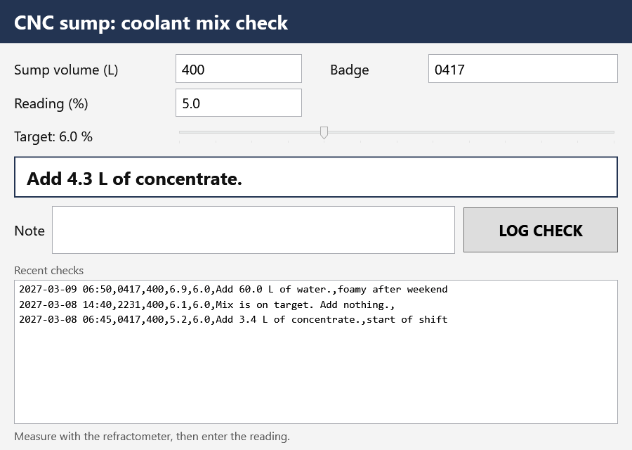

# Gate 2: Adversarial Review · Week 14
## 145065 Object-Oriented Programming · Unit 7 · Week 14, Friday

**Gate 2 is the gate where AI is the opponent.** You did not write this app. You are reviewing it,
and you are scored on what you catch against what you miss.

**35 minutes.** Individual and silent. You may and should build it, run it, and run its tests. You may
not ask a model whether it is correct, because a model is what is being reviewed.

**Everything here is invented.** Riverside Fabrication is a composite shop. The sump, the numbers, and
the badge numbers are made up. A real shop mixes coolant by its supplier's instructions and safety
data sheet, not by a student exercise.

The app is in `gate2-w14-files/`. Copy the folder, then:

```
dotnet build CoolantMix.sln
dotnet test CoolantMix.sln
dotnet run --project CoolantMix
```

---

## What you are looking at

A student gave an AI assistant the request in Part A and got back CoolantMix: a view model library, a
test project, and a WPF window. It builds with no warnings. **All 13 of its own tests pass:**

```
Passed!  - Failed:     0, Passed:    13, Skipped:     0, Total:    13, Duration: 106 ms - CoolantMix.Core.Tests.dll (net8.0)
```

**Passing tests are not the same as a correct app.** Ask what the tests check, and what they do not.

**There are exactly five planted defects, one for each Five-Dimension Code Review category:**
Correctness, Security, Readability, Performance, and Requirements Fit. They are **design** defects:
none of them stops the build or fails a test that ships with the app.

**One of the five is arguable.** A reasonable reviewer could defend it. For that one, give the
strongest case on each side, then say where you land.

**One of the five is subtle.** The screen looks right the first time you use it.

---

## PART A: The request

> Build CoolantMix, a WPF panel for the CNC coolant sump on Line 3. At the start of each shift the
> operator checks the mix with a refractometer. The panel says what to add, and logs the check.
>
> 1. **Inputs:** the sump volume in litres and the refractometer reading in percent (text boxes), the
>    target concentration in percent (a slider, 4 to 10 in steps of 0.5, starting at 6.0), the
>    operator's four-digit badge number, and an optional note.
> 2. **The instruction updates as soon as any input changes.** When the mix is too weak, it says how
>    many litres of concentrate to add. When it is too strong, how many litres of water. Within 0.2
>    points of target, `Mix is on target. Add nothing.`
> 3. **Arithmetic.** Concentrate to add = V × (target − reading) ÷ (100 − target). Water to add =
>    V × (reading − target) ÷ target. Show one decimal place.
> 4. **LOG CHECK** appends one line to the shared mix log, `mix-log.csv`, which the supervisor opens in
>    a spreadsheet: time, badge, volume, reading, target, instruction, and note. **Every value must land
>    in its own column, and anything typed into the note must appear as plain text, whatever it
>    contains.**
> 5. **LOG CHECK stays disabled until the badge is four digits** and the volume and reading are valid
>    numbers.
> 6. **The panel lists the five most recent log lines**, newest first. The shared log grows all year,
>    and the panel must stay quick to type into.
> 7. **All arithmetic lives in the view model library, with tests**, because the panel tells a person
>    how much chemical to add.

---

## PART B: What the AI produced

The window, with a volume, a reading, and a badge typed:



`CoolantMix.Core/MixViewModel.cs`, complete. Line numbers count from the first line of the file.

```csharp
// MixViewModel.cs
// View model for the CoolantMix panel. Holds the operator's inputs, works out
// what to add to the sump, and exposes the recent log for the window.

using System.ComponentModel;
using System.Globalization;
using System.Runtime.CompilerServices;

namespace CoolantMix.Core;

public sealed class MixViewModel : INotifyPropertyChanged
{
    /// <summary>A reading this close to the target needs nothing added.</summary>
    public const double OnTargetBand = 0.2;

    private readonly string logPath;
    private string volumeText = string.Empty;
    private string readingText = string.Empty;
    private double target = 6.0;
    private string badge = string.Empty;
    private string note = string.Empty;

    public MixViewModel(string logPath)
    {
        this.logPath = logPath;
    }

    public event PropertyChangedEventHandler? PropertyChanged;

    public string LogPath => logPath;

    /// <summary>Sump volume in litres, as typed.</summary>
    public string VolumeText
    {
        get => volumeText;
        set
        {
            if (Set(ref volumeText, value ?? string.Empty))
            {
                Recalculate();
            }
        }
    }

    /// <summary>Refractometer reading in percent, as typed.</summary>
    public string ReadingText
    {
        get => readingText;
        set
        {
            if (Set(ref readingText, value ?? string.Empty))
            {
                Recalculate();
            }
        }
    }

    /// <summary>Target concentration in percent. The slider binds here.</summary>
    public double Target
    {
        get => target;
        set => Set(ref target, value);
    }

    /// <summary>The operator's four-digit badge number.</summary>
    public string Badge
    {
        get => badge;
        set
        {
            if (Set(ref badge, value ?? string.Empty))
            {
                Recalculate();
            }
        }
    }

    /// <summary>Free-text note that goes in the log with the check.</summary>
    public string Note
    {
        get => note;
        set => Set(ref note, value ?? string.Empty);
    }

    /// <summary>What the operator should add, in words.</summary>
    public string Instruction
    {
        get
        {
            if (!TryVolume(out double volume) || !TryReading(out double reading))
            {
                return "Enter the sump volume and the reading.";
            }

            // Rounded first: 6.2 - 6.0 is 0.20000000000000018 in floating point.
            if (Math.Round(Math.Abs(reading - Target), 3) <= OnTargetBand)
            {
                return "Mix is on target. Add nothing.";
            }

            return reading < Target
                ? string.Format(CultureInfo.InvariantCulture, "Add {0:0.0} L of concentrate.", ConcentrateToAdd(volume, reading, Target))
                : string.Format(CultureInfo.InvariantCulture, "Add {0:0.0} L of water.", WaterToAdd(volume, reading, Target));
        }
    }

    /// <summary>True when the check has everything the log needs.</summary>
    public bool CanLog => TryVolume(out _) && TryReading(out _);

    /// <summary>The five most recent log lines, newest first.</summary>
    public IReadOnlyList<string> RecentLines =>
        File.Exists(logPath)
            ? File.ReadAllLines(logPath).Reverse().Take(5).ToList()
            : Array.Empty<string>();

    /// <summary>Litres of concentrate that raise the mix from reading to target.</summary>
    public static double ConcentrateToAdd(double volume, double reading, double target) =>
        volume * (target - reading) / (100.0 - target);

    /// <summary>Litres of water that lower the mix from reading to target.</summary>
    public static double WaterToAdd(double volume, double reading, double target) =>
        volume * (reading - target) / target;

    /// <summary>Call after a check has been written to the log.</summary>
    public void LogWritten()
    {
        Note = string.Empty;
        OnPropertyChanged(nameof(RecentLines));
    }

    private bool TryVolume(out double volume) =>
        double.TryParse(VolumeText, NumberStyles.Float, CultureInfo.InvariantCulture, out volume)
        && volume > 0 && volume <= 5000;

    private bool TryReading(out double reading) =>
        double.TryParse(ReadingText, NumberStyles.Float, CultureInfo.InvariantCulture, out reading)
        && reading >= 0 && reading < 100;

    // Refresh everything that depends on the inputs.
    private void Recalculate()
    {
        OnPropertyChanged(nameof(Instruction));
        OnPropertyChanged(nameof(CanLog));
        OnPropertyChanged(nameof(RecentLines));
    }

    private bool Set<T>(ref T field, T value, [CallerMemberName] string? name = null)
    {
        if (EqualityComparer<T>.Default.Equals(field, value))
        {
            return false;
        }

        field = value;
        OnPropertyChanged(name);
        return true;
    }

    private void OnPropertyChanged(string? name) =>
        PropertyChanged?.Invoke(this, new PropertyChangedEventArgs(name));
}
```

`CoolantMix/MainWindow.xaml.cs`, complete.

```csharp
// MainWindow.xaml.cs
// CoolantMix: shows the operator what to add to the CNC sump and logs each
// check to the shared mix log.

using System.Globalization;
using System.IO;
using System.Windows;
using CoolantMix.Core;

namespace CoolantMix;

public partial class MainWindow : Window
{
    private readonly MixViewModel mix;

    public MainWindow()
        : this(DefaultLogPath)
    {
    }

    public MainWindow(string logPath)
    {
        InitializeComponent();
        mix = new MixViewModel(logPath);
        DataContext = mix;
    }

    public static string DefaultLogPath => Path.Combine(AppContext.BaseDirectory, "mix-log.csv");

    public MixViewModel Mix => mix;

    // Appends the current check to the shared mix log.
    private void LogButton_Click(object sender, RoutedEventArgs e)
    {
        string line = string.Join(",",
            DateTime.Now.ToString("yyyy-MM-dd HH:mm", CultureInfo.InvariantCulture),
            mix.Badge,
            mix.VolumeText,
            mix.ReadingText,
            mix.Target.ToString("0.0", CultureInfo.InvariantCulture),
            mix.Instruction,
            mix.Note);

        File.AppendAllText(mix.LogPath, line + Environment.NewLine);
        mix.LogWritten();
        StatusText.Text = "Check logged.";
    }
}
```

`CoolantMix/MainWindow.xaml`, the inputs, instruction, log button, and list:

```xml
<Grid Grid.Row="1" Margin="20,12,20,0">
    <Grid.ColumnDefinitions>
        <ColumnDefinition Width="230" />
        <ColumnDefinition Width="180" />
        <ColumnDefinition Width="40" />
        <ColumnDefinition Width="140" />
        <ColumnDefinition Width="*" />
    </Grid.ColumnDefinitions>
    <Grid.RowDefinitions>
        <RowDefinition Height="Auto" />
        <RowDefinition Height="Auto" />
        <RowDefinition Height="Auto" />
    </Grid.RowDefinitions>

    <TextBlock Grid.Row="0" Grid.Column="0" Text="Sump volume (L)" />
    <TextBox Grid.Row="0" Grid.Column="1" x:Name="VolumeBox"
             Text="{Binding VolumeText, UpdateSourceTrigger=PropertyChanged}" />
    <TextBlock Grid.Row="0" Grid.Column="3" Text="Badge" />
    <TextBox Grid.Row="0" Grid.Column="4" x:Name="BadgeBox" MaxLength="4"
             Text="{Binding Badge, UpdateSourceTrigger=PropertyChanged}" />

    <TextBlock Grid.Row="1" Grid.Column="0" Text="Reading (%)" />
    <TextBox Grid.Row="1" Grid.Column="1" x:Name="ReadingBox"
             Text="{Binding ReadingText, UpdateSourceTrigger=PropertyChanged}" />

    <TextBlock Grid.Row="2" Grid.Column="0" x:Name="TargetText"
               Text="{Binding Target, StringFormat=Target: {0:0.0} %}" />
    <Slider Grid.Row="2" Grid.Column="1" Grid.ColumnSpan="4" x:Name="TargetSlider"
            Minimum="4" Maximum="10" TickFrequency="0.5" IsSnapToTickEnabled="True"
            TickPlacement="BottomRight" VerticalAlignment="Center" Margin="0,10,0,10"
            Value="{Binding Target}" />
</Grid>

<Border Grid.Row="2" Margin="20,8,20,0" Padding="16,10" Background="White"
        BorderBrush="#233452" BorderThickness="2">
    <TextBlock x:Name="InstructionText" Text="{Binding Instruction}" FontSize="26" FontWeight="Bold" />
</Border>

<Grid Grid.Row="3" Margin="20,8,20,0">
    <Grid.ColumnDefinitions>
        <ColumnDefinition Width="Auto" />
        <ColumnDefinition Width="*" />
        <ColumnDefinition Width="220" />
    </Grid.ColumnDefinitions>
    <TextBlock Grid.Column="0" Text="Note" Margin="0,0,10,0" />
    <TextBox Grid.Column="1" x:Name="NoteBox" MaxLength="120" Margin="0,4,12,4"
             Text="{Binding Note, UpdateSourceTrigger=PropertyChanged}" />
    <Button Grid.Column="2" x:Name="LogButton" Content="LOG CHECK"
            IsEnabled="{Binding CanLog}" Click="LogButton_Click" />
</Grid>

<DockPanel Grid.Row="4" Margin="20,8,20,0">
    <TextBlock DockPanel.Dock="Top" Text="Recent checks" FontSize="16" Foreground="#5A5A5A" />
    <ListBox x:Name="RecentList" ItemsSource="{Binding RecentLines}" FontSize="15"
             FontFamily="Consolas" Margin="0,4,0,0" />
</DockPanel>
```

`CoolantMix.Core.Tests/MixArithmeticTests.cs` tests the two formulas, the three kinds of instruction,
the on-target band, and four kinds of bad input. Read it to see what it covers.

**Read the request's items 2, 4, 5, and 6 against the code before you read anything else.**

---

## What to submit

For each defect: **where** (file and line), **which dimension**, **what goes wrong for the operator or
the supervisor if nobody catches it**, and **the fix**.

Then two more entries:

- **The arguable one.** Say which of your five it is. Give the strongest case that it is a defect and
  the strongest case that it is fine, then say where you land and why.
- **What I was unsure about.** Name something specific. A blank costs more than a wrong guess.

### How to spend 35 minutes

- **First 5:** build, run the tests, run the app. Type 400 and 5.0 and read the instruction.
- **Next 10:** use every input, in more than one order. Watch the instruction after each change.
- **Next 10:** for items 4, 5, and 6, point at the line that meets each one. Ask what the log file
  looks like to a spreadsheet, not to you.
- **Rest:** for each property, ask who announces it and when. Then write your entries.

---

## Scoring

Five defects, one point each. The arguable entry, one point. The unsure-about entry, one point.
**Your instructor states the Security weighting before you start.**

**Four of five is a strong score.**
